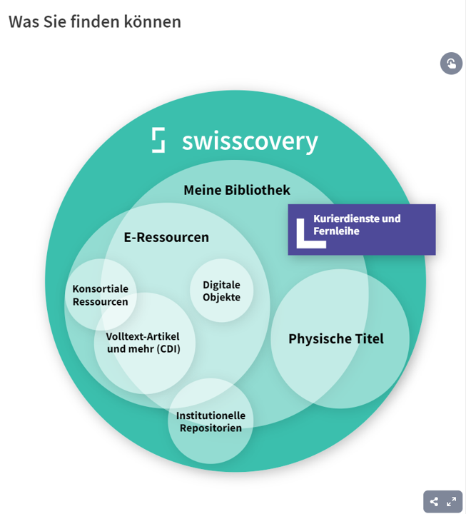
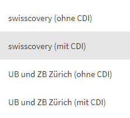

# Recherchekurs Japanologie

---

## Menü
1. Einführung in Swisscovery für Japanologe
1. Fachinformationsseite

---

# Einführung in Swisscovery für Japanologe

---

---

## Mehrere "Swisscover**ies**"
- [Swisscovery (Allgemein)](https://swisscovery.slsp.ch/discovery/search?vid=41SLSP_NETWORK:VU1_UNION)
- [Swisscovery für UB & ZB Zürich](https://uzb.swisscovery.slsp.ch/discovery/search?tab=41SLSP_UZB_DN_and_CI&search_scope=DN_and_CI&vid=41SLSP_UZB:UZB&offset=0)
- ... und weitere Swisscoveries von den anderen Schweizer Hochschulen

---

### Swisscovery für UB & ZB Zürich

- CDI = Central Descovery Index
- ohne CDI = Suche nach Titel-Ebene der Monographien und Zeitschriften
- mit CDI = Suche nach allen möglichen Titel (Artiel, Buchkapitel usw.)

--- 

## Swisscovery für Japanologe
- Suche mit Japanischen Schriftzeichen __und__ Umschrift möglich
- Schlagwörter überwiegend auf Deutsch (GND)
- ... Dennnoch die Literatur auf Japanisch in den Spezialdatenbanken suchen

---

## [Fachinformationsseite](https://www.ub.uzh.ch/de/unterstuetzung-erhalten/fachliche-unterstuetzung/japanologie.html)
- Ausgewählte weiterführende Datenbanken
- Links zu Fernleihe und Kopiebestellungen usw.
- Liaison Librarian (mich!!!) buchen!!!

---

# Vielen Dank!

