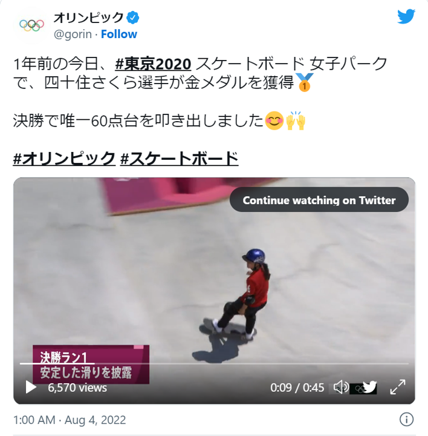

# Twitter-Daten sammeln und mit Elasticsearch analysieren
Nobutake Kamiya (Universität Zürich, Universitätsbibliothek)

---

# Was ich hier anbiete:
- Wie man Twitter-Daten sammelt (Python)
- Einführung der Tools für Datenanalyse (Elasticsearch und weitere Plugins)
- Denkanstoss für Handhabung der Daten / Datenmanagement

---

# Das Ziel ist [hier](http://localhost:5601) 
Der Link führt zu meinem lokalen Server. Deshalb funktioniert er nur von meinem PC...

---

# Was ich hier **NICHT** anbiete:
- Eine wissenschaftliche Erkenntnis
- Fachspezifische Forschungsmethode

---

# Tweets sammeln

---

## Tweets sammeln : Methode
- Twitter API v2 - Academic Research
- Python

---
## Übersicht von [Twitter API](https://developer.twitter.com/en/docs/twitter-api))
|Essential              | Elevated              | Academic Research                         |
|-----------------------|-----------------------|-------------------------------------------|
|500'000 tweets / Monat | 2 Mio. Tweets / Monat | 10 Mio. Tweets / Monat                    |
|Full-Archive-Suche nicht möglich | Full-Archive-Suche nicht möglich  | Full-Archive-Suche und Full-Archive-Count |
|      xx               |        xx             | Advanced search operator                  |

 

---
## Python-Code
Die gesamte Code ist [hier](https://github.com/NbtKmy/analyze_tweets/blob/main/searchTweets.py) zu finden.


---
## Python-Code : Query 1
Datum und Uhrzeit von Japanischer Zeit zu UTC
```Python
jst_st = datetime.datetime(2021, 3, 1, 0, 0, 0, 0, datetime.timezone(timedelta(hours=+9)))
jst_et = datetime.datetime(2021, 4, 1, 0, 0, 0, 0, datetime.timezone(timedelta(hours=+9)))

utc_st = jst_st.astimezone(timezone.utc)
utc_st = utc_st.isoformat()
utc_et = jst_et.astimezone(timezone.utc)
utc_et = utc_et.isoformat()
```

---
## Python-Code : Query 2
Suchbedingungen
```Python
query_params = {'query': '(オリンピック lang:ja -is:retweet) OR (五輪 lang:ja -is:retweet)',
                    'tweet.fields': 'created_at,id,text,public_metrics',
                    'start_time': utc_st,
                    'end_time': utc_et,
                    'max_results': 500}
```
Weitere Regeln siehe [hier](https://developer.twitter.com/en/docs/twitter-api/tweets/filtered-stream/integrate/build-a-rule#order-of-operations)

---
## Data cleaning


Beispiel: [Ein Tweet von der IOC (japanisch)](https://twitter.com/gorin/status/1554965339787579392)

---

## Python-Code : Data cleaning
```Python
# User-Name (Erwähungen), URL, Hash-tags und Zeilenumbrüche aus dem Tweets entfernen
    tw_text = re.sub(r'@\w+','', i['text'])
    tw_text = re.sub(r'(http|https)://[0-9a-zA-Z\./]+','', tw_text)
    tw_text = re.sub(r'#.+?(\s|$)', '', tw_text)
    tw_text = re.sub(r'\n','', tw_text)
# Kana soll immer in Fullwidth-Zeichen dargestellt werden
    tw_text = mojimoji.han_to_zen(tw_text, kana=True, digit=False, ascii=False)
# Digit und Ascii sollen immer in Halfwidth-Zeichen dargestellt werden
    tw_text = mojimoji.zen_to_han(tw_text, kana=False, digit=True, ascii=True)
```

---

## Besonderheiten bei der Twitter-Daten
- "Academic researchers are permitted to distribute an unlimited number of Tweet IDs and/or User IDs [...]", aber mehr nicht. [Developer terms (unter "content redistribution")](https://developer.twitter.com/en/developer-terms/policy)
- Tweets können gelöscht werden!

---

## Nachvollziehbarkeit?
- Code für die Query und für Data cleaning ebenso publizieren
- Datum der Ausführung dokumentieren

---

# Elasticsearch

---

## Plugins für Japanisch
- Kuromoji
- ICU
- Sudachi 

In diesem Beispiel werden Kuromoji und ICU für Analyzer verwendet

---

## Einstellung des Analyzers
- Konfiguration kann in JSON-Format geschrieben werden
- Charfilter (Normalisierung der Schriftzeichen, fakultativ)
- Tokenizer (Worttrennung [z.B. N-gram], notwendig, nur ein Tokenizer anwendbar)
- Token filter (Wörter [z.B. Stopwörter] werden nach bestimmten Regeln gefiltert, fakultativ)


---

## Einstellung mit dem Beispielsatz

```JSON
{
    "analyzer": "my_kuromoji_analyzer",
      "text": "そのオリンピック選手は身長１９６㌢という長身だった。人々はおどろいた。二〇〇〇人がオリンピックを観戦しながらコンピューターをつかっていた"
}
```

---

## Charfilter - Einstellung

```JSON
{
    "settings": {
        "analysis": {
            "analyzer": {
                "my_kuromoji_analyzer": {
                    "type": "custom",
                    "char_filter" : ["icu_normalizer", "kuromoji_iteration_mark"],
                    "tokenizer": "keyword"
                }
            }
        }
    }
}
```


