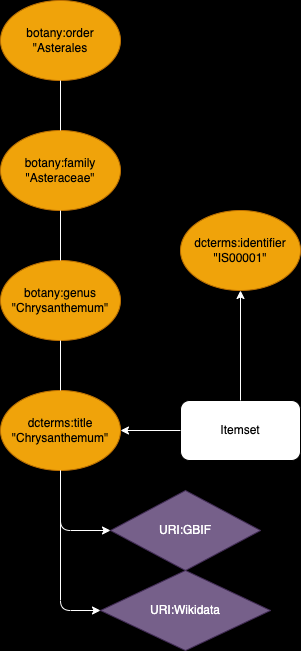

# **Creating Natural History Collection with Omeka S**
## Can a digital NHC be created by a researcher? 

Nobutake Kamiya (University of Zurich)

---

# [Omeka S](https://omeka.org/s/) is...

- a web publication platform and an open source software (license GPLv3)
- originally developed by [Roy Rosenzweig Center for History and New Media](https://rrchnm.org/)
- a [Digital Scholar](https://digitalscholar.org/) project

## You can create your own assets and metadata and publish them easily!

---

# Omeka S - Example usage for Judith's project

- Select modules 
- Consider the data model

---

# Omeka S - Modules
In this example use case the following modules are installed:

- [Scripto](https://omeka.org/s/modules/Scripto)
- [IIIF Server](https://omeka.org/s/modules/IiifServer/), [Image Server](https://omeka.org/s/modules/ImageServer/) & [Universal Viewer](https://omeka.org/s/modules/UniversalViewer/)
- [Folksonomy](https://omeka.org/s/modules/Folksonomy/)
- [Export](https://omeka.org/s/modules/Export/)

---

# Omeka S - Data structure 1

Use case: A researcher is collecting images (drawing, painting etc.) of different flowers, to find out the aesthetic and cultural meanings of the flowers. 

2 data schemes, item set and item:
- Item set should describe a sort of plant/flower (in this case "Chrysanthemum")
- Used vocabularies [dcterms](https://www.dublincore.org/specifications/dublin-core/dcmi-terms/) and [botany](https://ontologi.es/biol/botany#complex)

---

# Omeka S - Data structure 2

- The scheme "item" should describe the image of flowers
- Used vocabularies dcterms and [CIDOC-CRM](https://cidoc-crm.org/)

---

# Omeka S - in use

[Backend](https://imageserver.j-images.ch/omeka-s/admin)

[Frontend](https://imageserver.j-images.ch/omeka-s/s/home/page/about)

---

# Questions

- Can a digital NHC be created by a researcher? or Can such a dataset be defined as NHC?
- If yes, how can we make the digital NHC sustainable?

