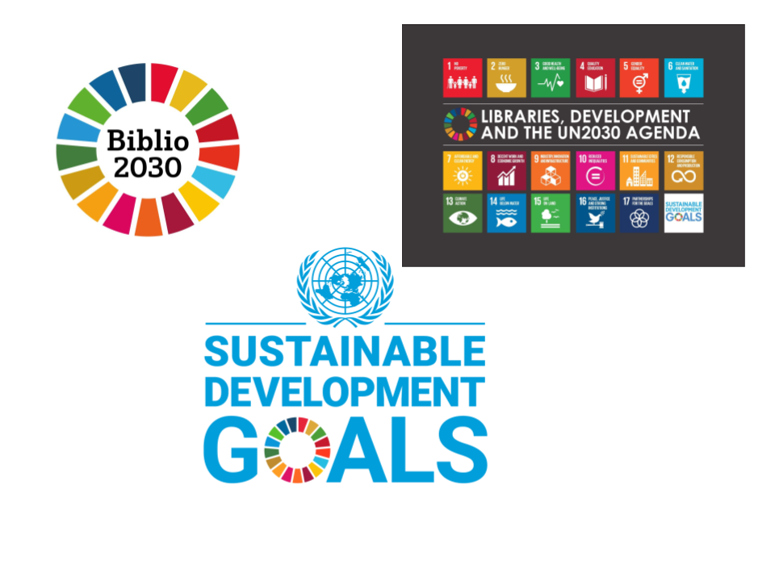

<header>

</header>

# Nachhaltigkeit

Kick-off Meeting

---

<header class="header_2nd">

</header>

## Was wollen wir überhaupt hier?
- Nachhaltigkeit in die UB Zürich einführen
- ... und sie langfristig etablieren und aufrechterhalten
- Aber bitte kein "__Greenwashing__"

---

<header class="header_2nd">

</header>

## Wie können wir es erreichen?
- Nachhaltigkeit - Definition/Vorstellungen verdeutlichen und vermitteln (z.B. [Brundtland Report](https://nbtkmy.github.io/presentations/Nachhaltigkeit/presentation_short_20230208.pdf#page=10) usw.)
- Pläne für Nachhaltigkeit in die UB-Leitung / UB-Politik hochbringen
- Kooperieren mit der ganzen UZH und mit den weiteren externen Institutionen, UB Bern, Bibliosuisse, UB Freie Univ. Berlin usw.

---

<header class="header_2nd">

</header>

## Wie können wir es erreichen? - Vorschlag
- Arbeitsgruppe Nachhaltigkeit gründen
- Aufkläreungsarbeit innerhalb der UB
- AG steht für Zielsetzungen, Assessments und Gespräch mit der UB-Leitung und den Externen

---

<header class="header_2nd">

</header>

## Frage an EUCH!
- Wer macht __AKTIV__ mit?
- Wie verfahren wir weiter? Nächstes Treffen?
- Was machen wir zunächst?

---

<header class="header_2nd">

</header>

## Mittelfristige Visionen : SDGs (Sustainable Development Goals)

---

<header class="header_2nd">

</header>

## Mittelfristige Visionen : SDGs (Sustainable Development Goals)
- [UN](https://www.un.org/sustainabledevelopment/sustainable-development-goals/)
- [IFLA : Powering Sustainable Development](https://www.ifla.org/de/units/sustainable-development/)
- [Bibliosuisse](https://www.bibliosuisse.ch/aktivitaten/kampagnebiblio2030)

---

<header class="header_2nd">

</header>

## Präsentationsfolie aus der Veranstaltung Nachhaltigkeit in der WB (Dez. 2022)

Nachhaltigkeit-Team > Datei > [Bibliosuisse_Austausch](https://uzh.sharepoint.com/:f:/s/NachhaltigkeitinBibliotheken/Eh1mHkTMW9FDlv_CRUOuh40BOhAdcE6GtGFkldQTbDKd-A?e=Iezhub)

---

<header class="header_2nd">

</header>

## Brundtland Report 1987

- [Brundtland Report in Wikisource](https://en.wikisource.org/wiki/Brundtland_Report)
- [Als PDF](https://www.are.admin.ch/are/de/home/medien-und-publikationen/publikationen/nachhaltige-entwicklung/brundtland-report.html)

---

## [Brundtland Report/Chapter 2. Towards Sustainable Development § 1-3](https://en.wikisource.org/wiki/Brundtland_Report/Chapter_2._Towards_Sustainable_Development)

> 1. Sustainable development is development that meets the needs of the present without compromising the ability of future generations to meet their own needs. It contains within it two key concepts:
>
> - the concept of 'needs,' in particular the essential needs of the world's poor, to which overriding priority should be given; and
> - the idea of limitations imposed by the state of technology and social organization on the environment's ability to meet present and future needs.

---

> 2. Thus the goals of economic and social development must be defined in terms of sustainability in all countries—developed or developing, market-oriented or centrally planned. Interpretations will vary, but must share certain general features and must flow from a consensus on the basic concept of sustainable development and on a broad strategic framework for achieving it.
>
> 3. Development involves a progressive transformation of economy and society. A development path that is sustainable in a physical sense could theoretically be pursued even in a rigid social and political setting. But physical sustainability cannot be secured unless development policies pay attention to such considerations as changes in access to resources and in the distribution of costs and benefits. Even the narrow notion of physical sustainability implies a concern for social equity between generations, a concern that must logically be extended to equity within each generation.

---

<header class="header_2nd">

</header>

## Danke!

