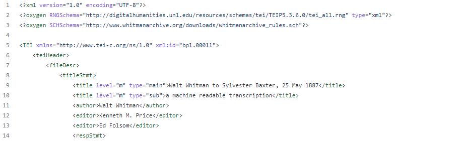
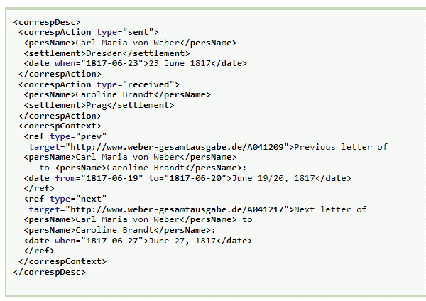

# TEI Vorstellung

---

# Ziel 
- Überblick über TEI geben
- Nutzen von TEI durch die Beispiele sichtbar machen

---

# TEI ist ...?

- Organisation "Text Encoding Initiative" (Gegründet 1987), seit 2000 "TEI Consortium"
- Dokumentformat / Auszeichungssprache (_markup language_) für div. Texte

---

# Warum eine _markup language_ interessant?
- Verbessert die Maschinenlesbarkeit
- Einheitliche Behandlung von unterschiedlichen Texten
- Nachhaltig, weil die Texte nach einem Regel markiert sind

---

# Wo findet man die TEI-Daten?

- Cambridge Digital Library (Beispiel: [Letter from C. R. Darwin to J. D. Hooker   [13 or 20 November 1843] (MS DAR 114: 1)](https://cudl.lib.cam.ac.uk/view/MS-DAR-00114-00001/1))

- Deutsches Textarchiv (Beispiel: [Goethe, Johann Wolfgang von: Aus meinem Leben](https://www.deutschestextarchiv.de/book/show/goethe_leben01_1811))

---

# Tools

- [TEI Wiki tool page](https://wiki.tei-c.org/index.php/Category:Tools)

---

# Beispiele?
- Beispiel 0: TEI unterschiedlich kodieren je nach Zwecke
- Beispiel 1: Visualisierung mit [Gatsby Framework](https://www.gatsbyjs.com/)
- Beispiel 2: Visualisierung mit JavaScript

---

# Beispiel 0
Unterschiedliche Kodierung von "A Midsummer Night’s Dream"
- Aus [der Sammlung "The Folger Shakespear"](https://shakespeare.folger.edu/downloads/teisimple/a-midsummer-nights-dream_TEIsimple_FolgerShakespeare.xml)
- Aus [Shakespeare's Plays (TEI Publisher Edition)](https://teipublisher.com/exist/apps/shakespeare-pm/index.html)

Je nach Zweck kann man "einen" Text unterschiedlich kodieren 

---

# Beispiel 1
TEI-Dokument auf der Webseite darstellen:
https://nbtkmy.github.io/gatsby_for_tei/public/index.html
Code: https://github.com/NbtKmy/gatsby_for_tei

---

# Beispiel 1
1. Eine TEI-Datei aus Shakespeare's Plays (TEI Publisher Edition) herunterladen
2. Mit [Gatsby Framework](https://www.gatsbyjs.com/), GraphQL und [gatsby-transformer-ceteicean](https://www.gatsbyjs.com/plugins/gatsby-transformer-ceteicean/) die Datei für die Webseite bereitstellen
3. Beliebige Elemente herausfiltern und darstellen

---

# Beispiel 2
TEI-Datei anders visualisieren
https://nbtkmy.github.io/tei_demonstration/index.html
Code: https://github.com/NbtKmy/tei_demonstration

---

# Beispiel 2
Beispiel mit [Whitman Archive / Correspondence](https://whitmanarchive.org/biography/correspondence/index.html)
TEI-Daten auf Github-Repo [whitman-correspondence](https://github.com/whitmanarchive/whitman-correspondence)

---

# Beispiel 2
1. Einige in TEI kodierten Briefe herunterladen
2. Das  \<correspDesc\>-Element hinzufügen. Dabei Geo-Code hinzufügen (wird nachher erklärt)
3. Die Daten durch XPath ([evaluate-Methode](https://github.com/NbtKmy/tei_demonstration/blob/main/index.js#L37)) holen und darstellen

---

# Whitmann-Briefe nach TEI - 1
Bsp - [bpl.00011.xml](https://github.com/whitmanarchive/whitman-correspondence/blob/dev/source/tei/bpl.00011.xml)

---

# Whitmann-Briefe nach TEI - 2
[\<correspDesc\>-Tag](https://www.tei-c.org/release/doc/tei-p5-doc/en/html/ref-correspDesc.html) hinzufügen

---

# Vielen Dank!

