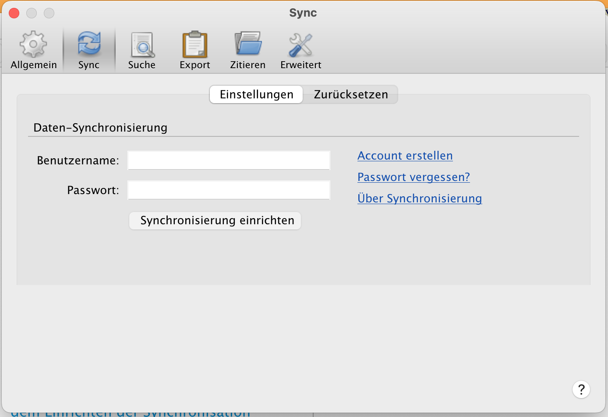
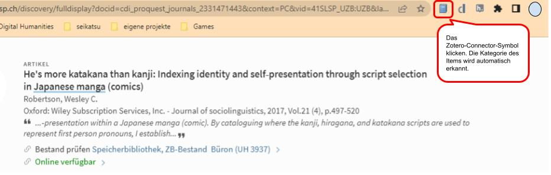
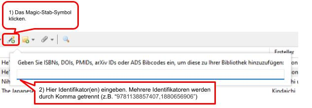
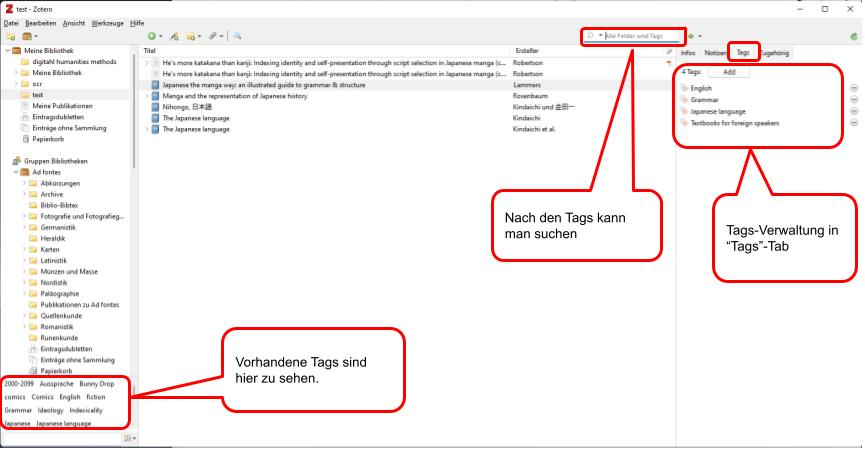
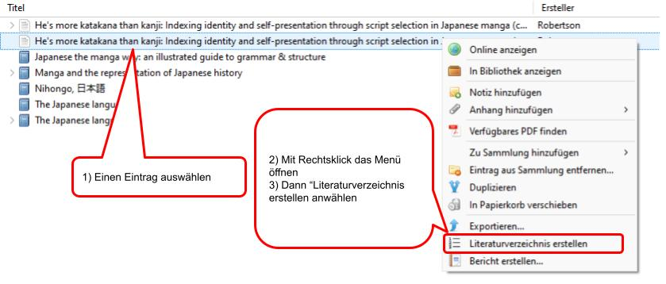
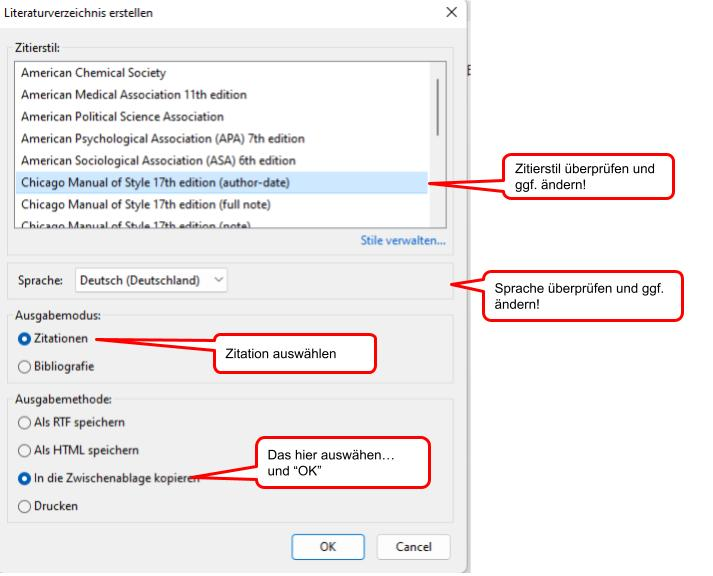
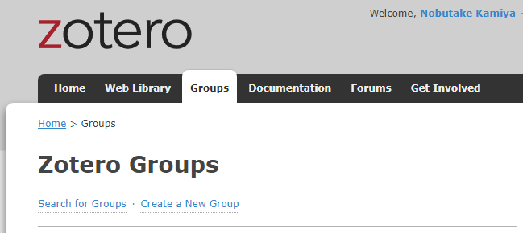
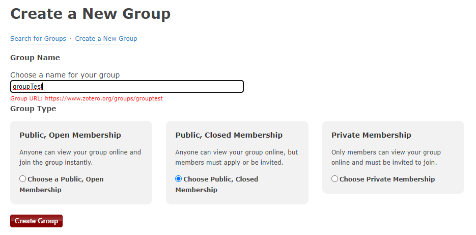
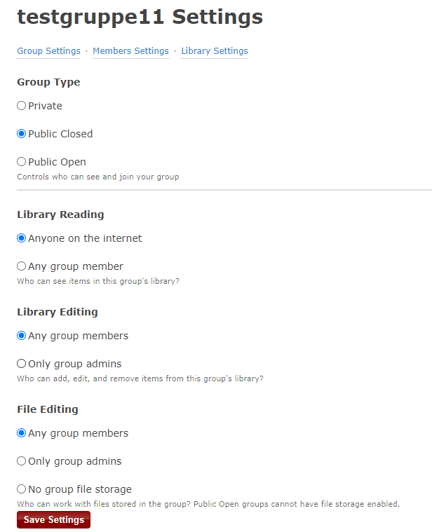
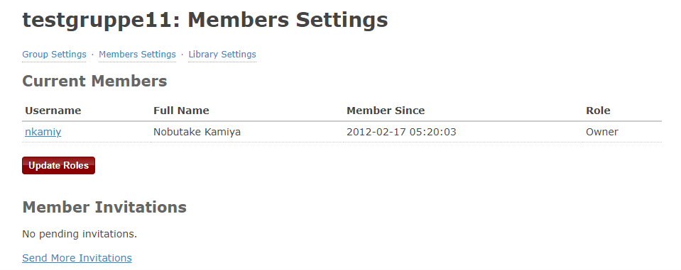

<header>

</header>

# Zotero-Einführung

Tools für das wissenschaftliche Informationsmanagement 
Nobutake Kamiya

---

<header class="header_2nd">

</header>

[Link zur offiziellen Seite](https://www.zotero.org/)

---

<header class="header_2nd">

</header>

## Was ist Zotero?
- Ein Literaturverwaltungssystem wie [Mendeley](https://www.mendeley.com/), [Endnote](https://endnote.com/) oder [Citavi](https://www.citavi.com/de/download)
- Eine Open Source Software ([Quellcode in Github](https://github.com/zotero/zotero))

---

<header class="header_2nd">

</header>

## Was kann man mit Zotero machen? I (= was wir heute machen)
- Zitat einfach erstellen
- Bibliografie erstellen
- Literatur importieren und mit Tags versehen
- Literaturliste über Cloud synchronisieren und mit anderen teilen und publizieren

---

<header class="header_2nd">

</header>

## Was kann man mit Zotero machen? II (= was wir heute __NICHT__ machen)
- PDFs annotieren (siehe Beschreibung der [neuen Funktionen von Zotero 6](https://www.zotero.org/blog/zotero-6/))
- Zitierstile editieren (mit [Citation Style Language](https://citationstyles.org/))
- Weitere [Plugins](https://www.zotero.org/support/plugins) verwenden

---

<header class="header_2nd">

</header>

## Heute verwenden wir ...
- [Zotero-Desktop App](https://www.zotero.org/download/)
- Einen Browser mit [Zotero-Connector](https://www.zotero.org/download/connectors)
- Einen Zotero-Account (Registration [hier](https://www.zotero.org/user/register))

---

<header class="header_2nd">

</header>

## Konfiguration I
1. Einen Zotero-Account erstellen
1. Zotero-App auf dem PC installieren
1. Zotero-Connector auf dem Browser installieren

---

<header class="header_2nd">

</header>

## Konfiguration II
4. Zotero-App mit dem Zotero-Account verbinden ("Einstellung" > "Sync")

---

<header class="header_2nd">

</header>

Vorführung: Importieren

---

<header class="header_2nd">

</header>

## Importieren aus dem Browser mit Zotero-Connector

---

<header class="header_2nd">

</header>

##  Importieren durch einen Identifikator wie ISBN oder DOI

---

<header class="header_2nd">

</header>

## Taggen

---

<header class="header_2nd">

</header>

Vorführung: Zitat und Bibliografie

---

<header class="header_2nd">

</header>

## Zitat im Text I

---

<header class="header_2nd">

</header>

## Zitat im Text II

---

<header class="header_2nd">

</header>

## Bibliografie

Im Prinzip ist der Prozess gleich wie bei Zitationen.
Man kann mehrere Einträge für die Bibliografie auswählen und "Bibliografie" statt "Zitationen" auswählen

--- 

<header class="header_2nd">

</header>

Vorführung: Liste teilen und publizieren

---

<header class="header_2nd">

</header>

## Liste teilen I
Im Browser in Zotero einloggen...

---

<header class="header_2nd">

</header>

## Liste teilen II

---

<header class="header_2nd">

</header>

## Liste teilen III

---

<header class="header_2nd">

</header>

## Liste teilen IV

---

<header class="header_2nd">

</header>

## Liste publizieren
Weil wir jetzt eine "öffentliche" Gruppe erstellt haben,
ist die Liste für die Öffentlichkeit zugänglich:
https://www.zotero.org/groups/4855842/testgruppe11/library

Und man kann auch die Metadaten über eine API hervorrufen:
https://api.zotero.org/groups/4855842/items?format=json

---

## Vielen Dank!