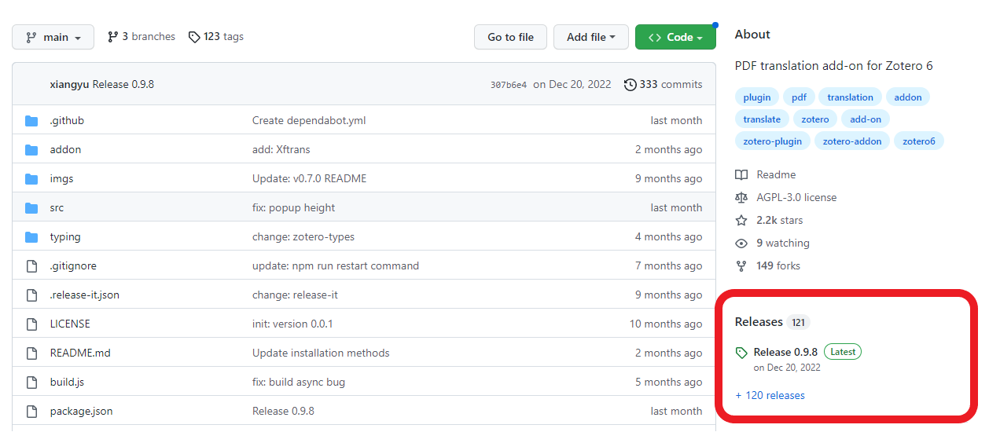

<header>

</header>

# PDF-Dokumente übersetzen in Zotero

Tools für das wissenschaftliche Informationsmanagement 
Nobutake Kamiya

---

<header class="header_2nd">

</header>

[Link zur offiziellen Seite](https://www.zotero.org/)

---

<header class="header_2nd">

</header>

## Was ist Zotero?
- Ein Literaturverwaltungssystem wie [Mendeley](https://www.mendeley.com/), [Endnote](https://endnote.com/) oder [Citavi](https://www.citavi.com/de/download)
- Eine Open Source Software ([Quellcode in Github](https://github.com/zotero/zotero))

---

<header class="header_2nd">

</header>

## Was kann man mit Zotero machen? I
- Zitat einfach erstellen
- Bibliografie erstellen
- Literatur importieren und mit Tags versehen
- Literaturliste über Cloud synchronisieren und mit anderen teilen und publizieren

---

<header class="header_2nd">

</header>

## Was kann man mit Zotero machen? II
- PDFs annotieren (siehe Beschreibung der [neuen Funktionen von Zotero 6](https://www.zotero.org/blog/zotero-6/))
- Zitierstile editieren (mit [Citation Style Language](https://citationstyles.org/))
- Weitere [Plugins](https://www.zotero.org/support/plugins) verwenden

---

<header class="header_2nd">

</header>

## Heute machen wir ...
- Ein Plugin [zotero-pdf-translate](https://github.com/windingwind/zotero-pdf-translate) installieren
- ...dann [DeepL](https://www.deepl.com/translator) als Übersetzungsprogramm einstellen

---

<header class="header_2nd">

</header>

## Voraussetzung
1. Zotero Stand alone (Version 6 oder höher) ist auf dem Rechner bzw. Laptop installiert
1. Für DeepL-API (kostenlos) braucht man eine Kreditkarte

---

<header class="header_2nd">

</header>

## Installation I : Plugin auswählen...
- Offizielle [Plugin-List](https://www.zotero.org/support/plugins)

---

<header class="header_2nd">

</header>

## Installation II : Github Repo "zotero-pdf-translate" I
- Unter der Kategorie "Releases" "latest" klicken

---

<header class="header_2nd">

</header>

## Installation III : Github Repo "zotero-pdf-translate" II
- XPI-File herunterladen (Bei FireFox rechts klick und "Speichern unter..." auswählen)

---

<header class="header_2nd">

</header>

## Installation IV : Github Repo "zotero-pdf-translate" II
- XPI-File herunterladen (Bei FireFox rechts klick und "Speichern unter..." auswählen)

---

<header class="header_2nd">

</header>

## Installation V : Add-ons Manager in Zotero-Stand alone
- Menü "Werkzeuge > Add-on" klicken
- Das Rädchen-Symbol klicken, dann weiter "Install Add-on From File" klicken 
- Das XPI-File auswählen und öffnen
- Zotero Stand alone neu starten
- Installation fertig!

---

<header class="header_2nd">

</header>

## Add-on Konfigurieren

- In Zotero-Stand alone "Bearbeiten" > "Einstellungen"
- Wenn das Add-on richtig installiert ist, taucht ein Tab "Translate" (s. die nächste Folie)

---

<header class="header_2nd">

</header>

## Add-on Konfigurieren

---

<header class="header_2nd">

</header>

## Add-on Konfigurieren - DeepL (Free plan) verwenden

- Ein Account bei [DeepL](https://www.deepl.com/pro-api?cta=header-pro-api) erstellen (Eine Kreditkarte notwendig!)
- Die "Konto"-Seite des DeepL-Accounts öffnen 

---

<header class="header_2nd">

</header>

## Add-on Konfigurieren - DeepL (Free plan) verwenden

- Auf der "Konto"-Seite unten findet man den Authentifizierungsschlüssel für API
- Wenn nicht, einen neuen Schlüssel erstellen

---

<header class="header_2nd">

</header>

## Add-on Konfigurieren - DeepL (Free plan) verwenden
- In der instellung vom Zotero-Stand alone "Translate" wählen
- Bei "Translation Services" "DeepL(Free Plan)" anwählen und den eigenen API-Key hineinkopieren
- Übersetzungssprachen ändern
- Fertig!    

---

<header class="header_2nd">

</header>

## Zu [DeepL API Free](https://www.deepl.com/docs-api)
- Max. 500.000 Zeichen pro Monat kostenlos 
- Max. Textmenge 128 KB pro ein Request
- Daten werden nicht so stark geschützt wie bei DeepL API Pro 

---
<header class="header_2nd">

</header>

## Vielen Dank!