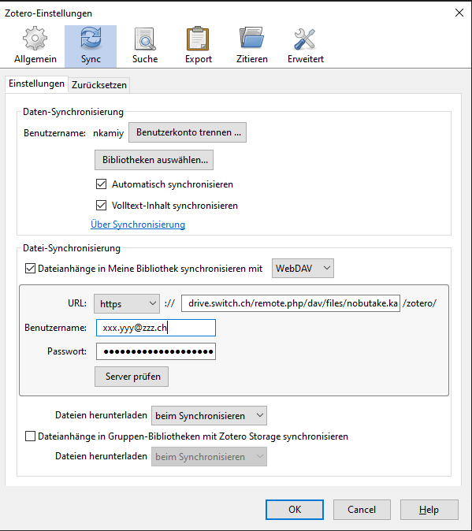
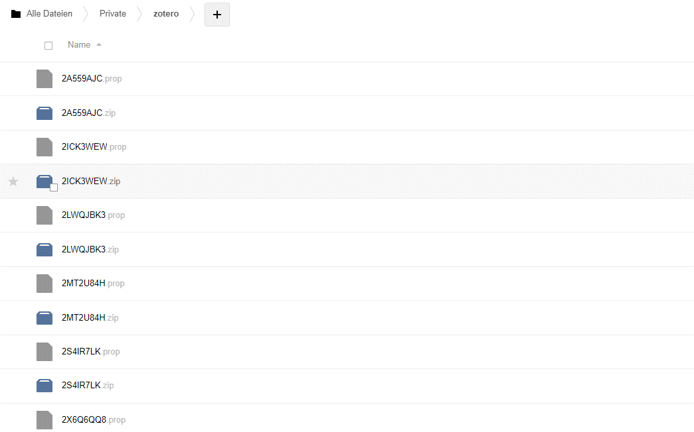
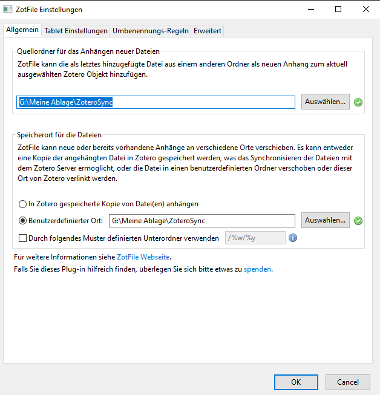
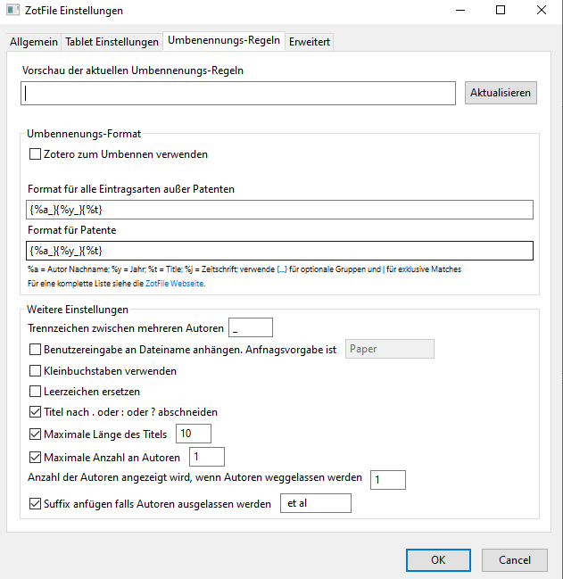
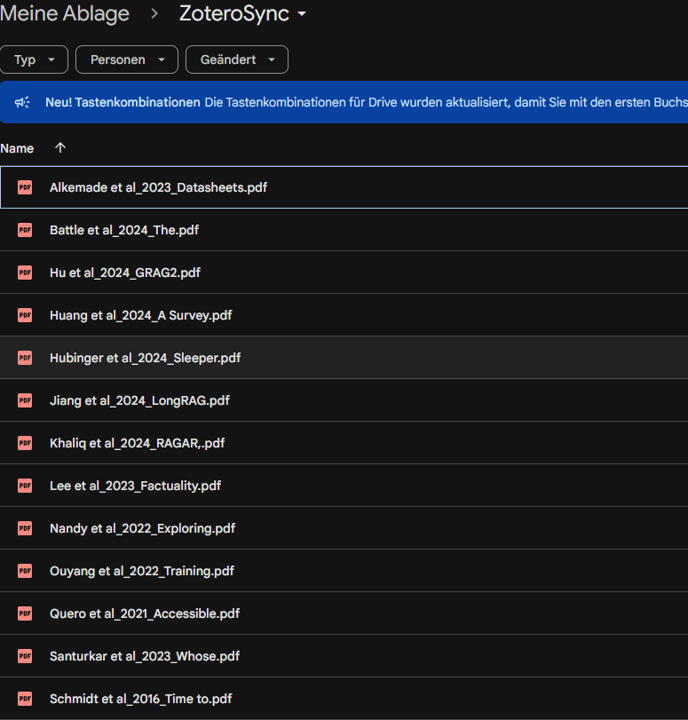

<header>

</header>

# Speicherkapazität in Zotero erweitern

Nobutake Kamiya

---

<header class="header_2nd">

</header>

[Link zur offiziellen Seite](https://www.zotero.org/)

---

<header class="header_2nd">

</header>

## Zotero?
- Ein Literaturverwaltungssystem wie [Mendeley](https://www.mendeley.com/), [Endnote](https://endnote.com/) oder [Citavi](https://www.citavi.com/de/download)
- Eine Open Source Software ([Quellcode in Github](https://github.com/zotero/zotero))
- PDF-Reader ab Version 6 [(UB Blog)](https://www.uzh.ch/blog/ub/2022/04/13/zotero-6-neu-mit-pdf-reader/)

---

<header class="header_2nd">

</header>

## Zotero hat aber wenig freie Speicherkapazität😿 
- kostenfreie [Zotero Storage](https://www.zotero.org/storage) nur 300 MB
- In Zotero Storage werden PDFs, images, web snapshot und weitere Files gespeichert

---

<header class="header_2nd">

</header>

Mehr Storage = Mehr glückliche Menschen

---

<header class="header_2nd">

</header>

## 2 Möglichkeiten Storage-Erweiterung
- [WebDAV](https://de.wikipedia.org/wiki/WebDAV) (z.B. SWITCHdrive)
- Cloudstorage (z.B. GoogleDrive, Dropbox, SWITCHdrive) + Zotfile

---

<header class="header_2nd">

</header>

Methode 1: WebDAV (SWITCHdrive)

---

<header class="header_2nd">

</header>

## WebDAV in [SWITCHdrive](https://www.switch.ch/en/drive)
- SWITCHdrive bietet 100 GB für Uni-Angehörige an
- SWITCHdrive bietet WebDAV-Zugriff an

---

<header class="header_2nd">

</header>

## SWITCHdrive konfigurieren 1
1. [Erläuterung hier](https://help.switch.ch/drive/faq/mobile-devices/)
1. [Einloggen](https://drive.switch.ch)!
1. Eigenen Account (oben rechts) klicken > Einstellungen klicken > "Sicherheit" in der linken Spalte klicken 
 

---

<header class="header_2nd">

</header>

## SWITCHdrive konfigurieren 2

- App-Passcode erstellen und sichern!

---

<header class="header_2nd">

</header>

## SWITCHdrive konfigurieren 3

1. Einen Ordner für Zotero-Storage erstellen (der Name des untersten Ordner muss "zotero" lauten): z.B. ~/Private/zotero
1. Unten links "Einstellung" klicken > Dort gibt es URL für WebDAV: "https://drive.switch.ch/remote.php/dav/files/[xxx.yyy%40zzz.ch]/"
1. Den vollständige URL bilden - z.B.: "https://drive.switch.ch/remote.php/dav/files/[xxx.yyy%40zzz.ch]/Private/zotero"

---

<header class="header_2nd">

</header>

## Zotero konfigurieren

1. Zotero > Bearbeiten > Einstellungen klicken > "Sync" klicken
1. Passende Optionen anhaken und WebDAV-URL und Passcode eingeben

---

<header class="header_2nd">

</header>

## Zotero konfigurieren

1. Zotero > Bearbeiten > Einstellungen klicken > "Sync" klicken
1. Passende Optionen anhaken und WebDAV-URL und Passcode eingeben

---

<header class="header_2nd">

</header>

## WebDAV fertig!

---

<header class="header_2nd">

</header>

Methode 2: Cloudstorage + Zotfile

---

<header class="header_2nd">

</header>

## Cloudstorage in einer lokalen Umgebung installieren
- Desktop-Applikation für ein Cloudstorage installieren: z.B. [GoogleDrive for Desktop](https://support.google.com/drive/answer/10838124?hl=de#)
- Einen Ordner für Zotero erstellen 

---

<header class="header_2nd">

</header>

## Zotero konfigurieren 1
- Plug-In "[ZotFile](https://zotfile.com/)" ins Zotero (Desktop-Applikation) installieren
- Zotero > Bearbeiten > Einstellungen klicken > "Erweitert"-Tab öffnen
- Dort bei "Basisverzeichnis für verlinkte Dateianhänge" den Pfad zu dem entsprechenden Ordner von Cloudstorage eingeben 
- __Achtung__ "Speicherort" so belassen!

---

<header class="header_2nd">

</header>

## Zotero konfigurieren 2
- Werkzeuge > Zotfile Einstellungen... klicken
- Tab "Allgemein" den Pfad eingeben

---

<header class="header_2nd">

</header>

## Zotero konfigurieren 3
- Tab "Umbenennungs-Regeln" ggf. anpassen 

---

<header class="header_2nd">

</header>

## Fertig!

---
<header class="header_2nd">

</header>

## Vielen Dank!