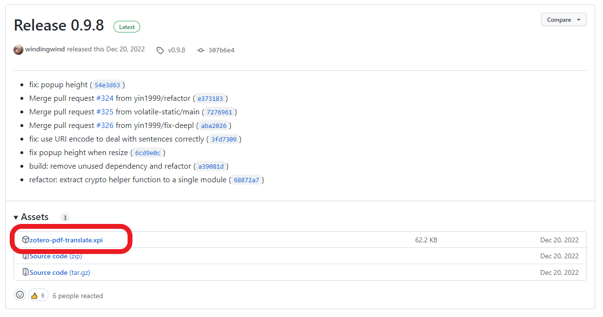

<header>

</header>

# PDF-Dokumente OCRisieren 

Tools für das wissenschaftliche Informationsmanagement 
Nobutake Kamiya

---

<header class="header_2nd">

</header>

[Link zur offiziellen Seite](https://www.zotero.org/)

---

<header class="header_2nd">

</header>

## Was ist Zotero?
- Ein Literaturverwaltungssystem wie [Mendeley](https://www.mendeley.com/), [Endnote](https://endnote.com/) oder [Citavi](https://www.citavi.com/de/download)
- Eine Open Source Software ([Quellcode in Github](https://github.com/zotero/zotero))

---

<header class="header_2nd">

</header>

## Was kann man mit Zotero machen? I
- Zitat einfach erstellen
- Bibliografie erstellen
- Literatur importieren und mit Tags versehen
- Literaturliste über Cloud synchronisieren und mit anderen teilen und publizieren

---

<header class="header_2nd">

</header>

## Was kann man mit Zotero machen? II 
- PDFs annotieren (siehe Beschreibung der [neuen Funktionen von Zotero 6](https://www.zotero.org/blog/zotero-6/))
- Zitierstile editieren (mit [Citation Style Language](https://citationstyles.org/))
- Weitere [Plugins](https://www.zotero.org/support/plugins) verwenden

---

<header class="header_2nd">

</header>

## Heute machen wir ...
- [Tesseract](https://tesseract-ocr.github.io/tessdoc/Downloads.html) installieren
- [Poppler (Windows) wegen pdftoppm](https://github.com/oschwartz10612/poppler-windows) installieren
- Ein Plugin [Zotero OCR](https://github.com/UB-Mannheim/zotero-ocr) installieren
- Ein PDF-Dokument ohne Text OCRisieren

---

<header class="header_2nd">

</header>

## Voraussetzung
1. Zotero Stand alone (Version 6 oder höher) ist auf dem Rechner bzw. Laptop installiert

---

<header class="header_2nd">

</header>

## Installation I : Tesseract installieren...
- Offizielle [tesseract](https://tesseract-ocr.github.io/tessdoc/Downloads.html)-Seite
- Leider gibt es momentan keinen offiziellen Installer (Stand: 31.01.2023)
- Deshalb den Installer von UB Mannheim nehmen

---

<header class="header_2nd">

</header>

## Installation I : Tesseract installieren... (Windows)
- [Tesseract UB Mannheim](https://github.com/UB-Mannheim/tesseract/wiki)
- Einen passenden Installer auswählen und herunterladen

---

<header class="header_2nd">

</header>

## Installation I : Tesseract installieren... (Windows)
- Bei __Windows__ exe-File ausführen
- Pfad merken

---

<header class="header_2nd">

</header>

## Installation II : Poppler installieren... (Windows)
- Das Github Repo [Poppler (Windows)](https://github.com/oschwartz10612/poppler-windows) besuchen
- Das neueste Release (ZIP-File) herunterladen
- ZIP-File in einem neuen Ordner entpacken und den Pfad merken

---

<header class="header_2nd">

</header>

## Installation III : Plugin "Zotero OCR" installieren...
- Offizielle [Plugin-List](https://www.zotero.org/support/plugins)
- [Zotero OCR](https://github.com/UB-Mannheim/zotero-ocr) anwählen

---

<header class="header_2nd">

</header>

## Installation III : Plugin "Zotero OCR" installieren...
- Unter der Kategorie "Releases" "latest" klicken

---

<header class="header_2nd">

</header>

## Installation III :  Plugin "Zotero OCR" installieren...
- XPI-File herunterladen (Bei FireFox rechts klick und "Speichern unter..." auswählen)

---

<header class="header_2nd">

</header>

## Installation IV :  Plugin "Zotero OCR" installieren...
- XPI-File herunterladen (Bei FireFox rechts klick und "Speichern unter..." auswählen)

---
## Vielen Dank!