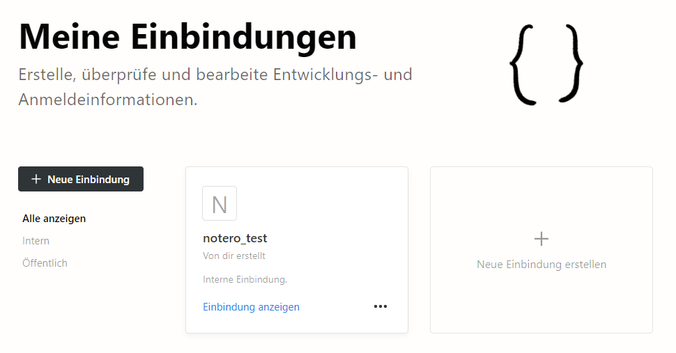
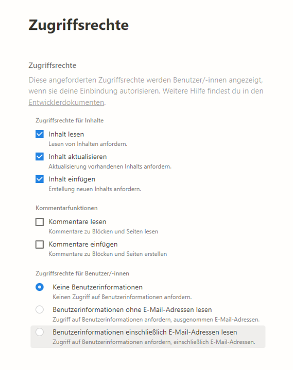
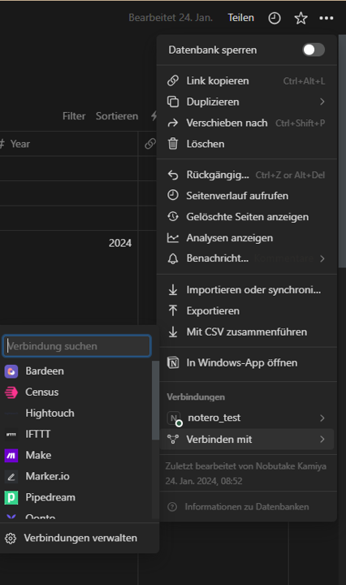

<header>

</header>

# Notero = Notion + Zotero

Nobutake Kamiya

---

<header class="header_2nd">

</header>

## [Notion](https://www.notion.so/) 
- Eine Webapplikation für Wissensmanagement
- Dienstleistung seit 2016; Anbieter Notion Labs Inc.
- Ähnliche Dienstleistungen - OneNote, Google Keep, Simplenote, Evernote
- Kostenfreie Nutzung möglich (siehe [Pricing](https://www.notion.so/de-de/pricing))
- Bietet auch ein kostenpflichtiges Plug-in [Notion-AI](https://www.notion.so/de-de/help/ai-pricing-and-usage#notion-ki-zu-deinem-plan-hinzufugen) (10 USD/Monat) an

---

<header class="header_2nd">

</header>

## [Zotero](https://www.zotero.org/) 

- Ein Literaturverwaltungssystem
- Open Source Software - [viele Plugins](https://www.zotero.org/support/plugins) vorhanden 

---

<header class="header_2nd">

</header>

## [Notero](https://github.com/dvanoni/notero)

- Ein Plugin für Zotero (Version 6.0.27 oder höher)
- Erstellt von David Vanoni, Software Entwickler
- Ermöglicht bibliographische Information und Notizen von Zotero in Notion zu übertragen 

---

<header class="header_2nd">

</header>

## DEMO - Wie funktioniert Notero?

---

<header class="header_2nd">

</header>

## Ja, ich will Notero! Aber wie?

Anleitung ist eigentlich im [Readme des Plugins](https://github.com/dvanoni/notero?tab=readme-ov-file#notero) gut dokumentiert...

Aber wir schauen es Schritt für Schritt!
1. Ein API-Token [Notion - Meine Einbindungen](https://www.notion.so/my-integrations) generieren und gut bewahren
1. Eine Tabelle ("Database") in Notion anlegen und selber konfigurieren oder die vorgefertigten Muster kopieren 
1. Zugriff von Notero auf die Tabelle zulassen
1. Notero in Zotero installieren und konfigurieren

---

<header class="header_2nd">

</header>

## API-Token von Notion erstellen 1

- "Neue Einbindung erstellen" klicken
- Einstellung bei "Verknüpfter Workspace" den eigenen Workspace auswählen & bei "Name" einen beliebigen Namen (und den Namen merken!)

---

<header class="header_2nd">

</header>

## API-Token von Notion erstellen 2

- "Inhalte lesen", "aktualisieren" und "einfügen" aktivieren
- Weitere Sachen können so bleiben, dann (endlich!) die neue Einbindung erstellen!
- "Internal Integration Secret" irgendwo speichern - Bitte dies geheim halten! 

---

<header class="header_2nd">

</header>

## Eine "Database" in Notion anlegen und konfigurieren 
Für die gemütlichen Leute...
-> [Example Notion Databases](https://github.com/dvanoni/notero?tab=readme-ov-file#example-notion-databases) kopieren

... Oder selber eine Database anlegen
-> [Notion Database Properties](https://github.com/dvanoni/notero?tab=readme-ov-file#notion-database-properties) ansehen und Name & Typen der Properties demnach einstellen

---

<header class="header_2nd">

</header>

## Zugriff von Notero auf die "Database" zulassen 

1. Die Database auswählen und "..."-Button oben rechts klicken 
1. Im Menü "Verbinden mit" auswählen
1. Im Suchfenster den Namen von deiner Einbindung eingeben und suchen 

--- 

<header class="header_2nd">

</header>

## Notero in Zotero installieren

1. [Die neueste Version von Notero-Addon (.xpi)](https://github.com/dvanoni/notero/releases) herunterladen
1. Wenn man FireFox als Browser hat, rechts klick und dann "Link speichern unter" klicken
1. In Zotero-Stand alone "Werkzeuge" -> "Add-ons" klicken
1. In dem Add-ons Manager das Rädchen-Symbol klicken -> "Install Add-on from File..." klicken und "notero-X.X.XX.xpi" auswählen
1. Notero installieren

---

<header class="header_2nd">

</header>

## Notero in Zotero konfigurieren

1. Im Zotero : "Werkzeuge" -> "Notero Preferences..." klicken
1. Bei "Integration token" das Secret Token von Notion und bei "Database" "Notero" eingeben
1. Property & Sync preference nach Belieben auswählen 
1. Fertig!!