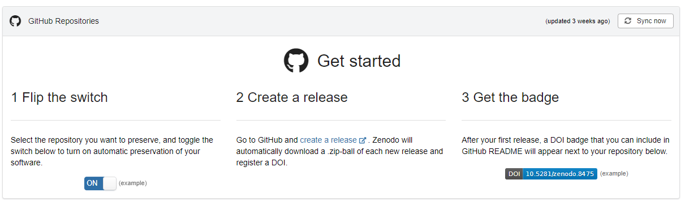

<style>
@import 'default';
/* Bootstrap */
@import url('https://cdn.jsdelivr.net/npm/bootstrap@5.0.2/dist/css/bootstrap.min.css');
@import url('https://fonts.googleapis.com/css2?family=Kosugi&family=Roboto+Mono&display=swap');

:root {
  --theme-yellow: #FEDE00;
  --theme-red: #DC6027;
  --theme-blue: #0028A5;
  --theme-grey: #A3ADB7;
}
header {
  width: 100%;
  height: 80px;
  position: absolute;
  left: -1px;
}
.header_2nd {
  border-bottom: 2px solid var(--theme-grey);
}
.img_links {
  position: relative;
  left: 20px;
}
.img_rechts {
  position: relative;
  left: 800px;
}
section h1 {
  font-size: 2.65rem;
  color: white;
}
section h2 {
    color: var(--theme-blue);
}
.text_white {
    font-size: 1.65rem;
    color: white;
}
.bg_grey {
    position: relative;
    left: -80px;
    width: 1600px;
    height: 520px;
    background-color: var(--theme-grey);
    text-indent: 100px;
    line-height: 200px;
}

</style>
<header>


</header>

# Notero = Notion + Zotero
<div class="text_white">Nobutake Kamiya</div>


---

<header class="header_2nd">


</header>

## [Notion](https://www.notion.so/) 
- Eine Webapplikation für Wissensmanagement
- Dienstleistung seit 2016; Anbieter Notion Labs Inc.
- Ähnliche Dienstleistungen - OneNote, Google Keep, Simplenote, Evernote
- Kostenfreie Nutzung möglich (siehe [Pricing](https://www.notion.so/de-de/pricing))
- Bietet auch ein kostenpflichtiges Plug-in [Notion-AI](https://www.notion.so/de-de/help/ai-pricing-and-usage#notion-ki-zu-deinem-plan-hinzufugen) (10 USD/Monat) an


---


<header class="header_2nd">


</header>

## [Zotero](https://www.zotero.org/) 

- Ein Literaturverwaltungssystem
- Open Source Software - [viele Plugins](https://www.zotero.org/support/plugins) vorhanden 


---

<header class="header_2nd">


</header>

## [Notero](https://github.com/dvanoni/notero)

- Ein Plugin für Zotero
- Erstellt von David Vanoni, Software Entwickler
- Ermöglicht bibliographische Information und Notizen von Zotero in Notion zu übertragen 


---

<header class="header_2nd">


</header>

## DEMO - Wie funktioniert Notero?


---

<header class="header_2nd">


</header>

## ...und wie das geht? Part 2

1. Bei Zenodo mit Github-Account anmelden
1. Dann "Profile Menü" oben rechts aufmachen. Darunter "Github" klicken
1. Dann erscheit die Anleitung, der du folgen kannst...


---


<header class="header_2nd">


</header>

## ...und wie das geht? Part 3




---
<header class="header_2nd">


</header>

## Zitieren erleichtern mit CFF-File

Wenn man die ZIP-File in Zenodo hochgeladen hat, erhält man DOI. Dies kann man wiederum in Github (README und CFF-File) hinzufügen!

Eine CFF-File sieht so aus:
```cff
cff-version: 1.2.0
authors:
  - family-names: Kamiya
    given-names: Nobutake
    orcid: https://orcid.org/0000-0002-5755-3322
title: "DB-App (Database Application)"
version: 1.0.0
doi: 10.5281/zenodo.8381877
date-released: 2023-09-26
```

---
<header class="header_2nd">


</header>

## UB hilft bei weiteren Themen wie...

- Erstellung der DMP (Data Management Plan)
- Data Management

Bitte bei Liaison Librarian in entsprechenden Bereichen fragen!