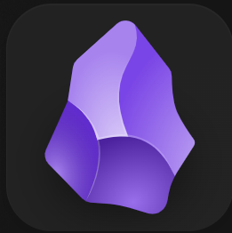

<header>

</header>

# Large language models in Obsidian: LocalGPT

Nobutake Kamiya

---

<header class="header_2nd">

</header>

---

<header class="header_2nd">

</header>

## Obsidian? Genz einfach
... ist ein Wissensmanagementsystem!
[Link zur offiziellen Seite](https://obsidian.md/)

---

<header class="header_2nd">

</header>

## Obsidian? Mehr Information
- Kein Open Source Software
- Aber kostenlos für private, nicht-kommerzielle Nutzung 
- Lokale Anwendung; Daten/Notizen lokal gespeichert (s. [Manifesto](https://obsidian.md/about))

---

<header class="header_2nd">

</header>

## Ollama? Ganz kurz!
... eine Software zur Ausführung von LLMs in der __lokalen__ Umgebung
[Link zur offiziellen Seite](https://ollama.com/)

---
<header class="header_2nd">

</header>

## Ollama? Mehr Information
- LLMs/VLMs sind quantifiziert (GGUF-Format)
- Sprach-Modelle laufen in der __lokalen__ Umgebung!
- Es ist auch möglich, ein eigenes Sprachmodell mit Ollama laufen zu lassen (ein Modell muss mit llama.cpp quantifiziert und in das GGUF-Format konvertiert werden)

---

<header class="header_2nd">

</header>

## Wie geht das? - Durch Plugin!

# [__LocalGPT__](https://forum.obsidian.md/t/local-gpt-plugin-with-ollama-and-openai-like-providers/73466)

---

<header class="header_2nd">

</header>

## Installation
1. Obsidian und Ollama installieren
1. Modells in Ollama installieren
1. Restriction mode ausschalten (Die Community plugins werden zugelassen)
1. Plugins browsen und die Plugins "AI Provider" und "LocalGPT" auswählen
1. LocalGPT konfigurieren!

---

<header class="header_2nd">

</header>

## Was kann LocalGPT?

Mit Shortcut-Keys kann man folgende Funktionen ausführen:

- Schreiben fortsetzen
- Text Zusammenfassen
- Text-Korrektur

usw...

---

<header class="header_2nd">

</header>

## Demo

---

<header class="header_2nd">

</header>

## Fragen?

