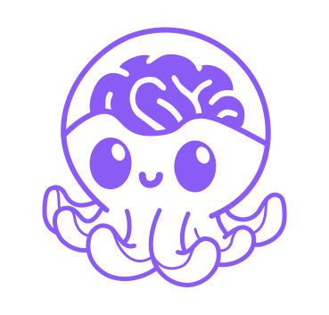

<header>

</header>

# Large language models in Obsidian: Smart Second Brain

Nobutake Kamiya

---

<header class="header_2nd">

</header>

---

<header class="header_2nd">

</header>

## Obsidian? Ganz einfach
... ist ein Wissensmanagementsystem!
[Link zur offiziellen Seite](https://obsidian.md/)

---

<header class="header_2nd">

</header>

## Obsidian? Mehr Information
- Kein Open Source Software
- Aber kostenlos für private, nicht-kommerzielle Nutzung 
- Lokale Anwendung; Daten/Notizen lokal gespeichert (s. [Manifesto](https://obsidian.md/about))

---

<header class="header_2nd">

</header>

## Ollama? Ganz kurz!
... eine Software zur Ausführung von LLMs in der __lokalen__ Umgebung
[Link zur offiziellen Seite](https://ollama.com/)

---
<header class="header_2nd">

</header>

## Ollama? Mehr Information
- LLMs/VLMs sind quantifiziert (GGUF-Format)
- Sprach-Modelle laufen in der __lokalen__ Umgebung!
- Es ist auch möglich, ein eigenes Sprachmodell mit Ollama laufen zu lassen (ein Modell muss mit llama.cpp quantifiziert und in das GGUF-Format konvertiert werden)

---

<header class="header_2nd">

</header>

## Wie geht das? - Durch Plugin!

# [__Smart Second Brain__](https://github.com/your-papa/obsidian-Smart2Brain)

---

<header class="header_2nd">

</header>

## Was kann Smart Second Brain?

- Chat mit dir!
- Deine Notizen in Obsidian werden von RAG im Chat reflektiert!
- Du führst quasi ein Selbstgespräch mit dir selbst (deshalb "Second Brain"!)

---

<header class="header_2nd">

</header>

## Demo

---

<header class="header_2nd">

</header>

## Fragen?

