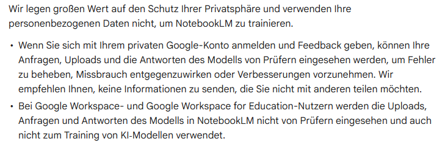
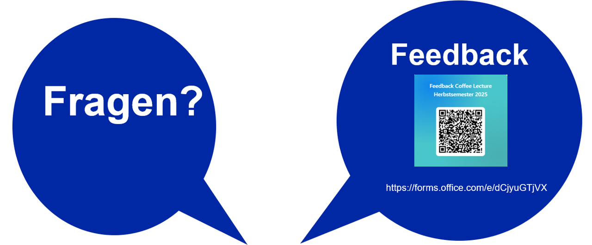

<header>

</header>

# NotebookLM als Lernpartner für das Studium

Nobutake Kamiya

---

<header class="header_2nd">

</header>

---

<header class="header_2nd">

</header>

## [NotebookLM](https://notebooklm.google/) in Kürze

- Kostenfreie Webapplikation (...aber, Google-Account notwendig)
- Es gibt kostenpflichtige "NotebookLM Pro" auch (Hier reden wir nur über kostenfreie Version)
- Unterschiedliche "Quellen" einlesen und auf dem Basis der Quelleninformation mit LLM Chatten
- Notizen mit Hilfe des LLM erstellen und sie als Quelle speichern
- Aus den ausgewählten Quellen ein "podcast interview like" Audio-Datei generieren
- __Neu__: Notebook kann jetzt mit jemandem geteilt werden 

---

<header class="header_2nd">

</header>

## Wichtiges in Kürze
- Es sind 3 Nutzungsbedingungen ([Google Workspace](https://workspace.google.com/terms/premier_terms/), [Google Workspace for Education](https://workspace.google.com/terms/education_terms/), [Google-Nutzungsbedingungen](https://policies.google.com/terms)) vorhanden. Sie sind unterschiedlich. Im Weiteren ziehen wir nur Google-Nutzungsbedingungen in Betracht
- Nutzungsbedingugnen für kostenpflichtige Umgebung [hier](https://support.google.com/notebooklm/answer/16213268?ref_topic=16175214&sjid=1596286602733096536-NC)
- Model Gemini 2.5 Flash-Lite(?) (Stand: 26. Juni 2025, siehe [hier](https://developers.googleblog.com/en/gemini-2-5-thinking-model-updates/))

---

<header class="header_2nd">

</header>

## ... Bitte einmal selber lesen! 

(Zuletzt gesichtet am 26.06.2025 [hier](https://support.google.com/notebooklm/answer/16164461?hl=de&ref_topic=16164070&sjid=7309936810068079434-EU))

---

<header class="header_2nd">

</header>

## Was kann NotebookLM?

- Quelle zusammenfassen
- Chatten mit LLM mit Quellen-Wissen
- Notizen erstellen bzw. Notizen LLM erstellen lassen
- Podcast-artiges Gespräch generieren
- Ein Notebook teilen
- usw...

---

<header class="header_2nd">

</header>

## Demo

---
<header class="header_2nd">

</header>

  
Kontakt

  
nobutake.kamiya@ub.uzh.ch

---

<header class="header_2nd">

</header>

## Vielen Dank!

