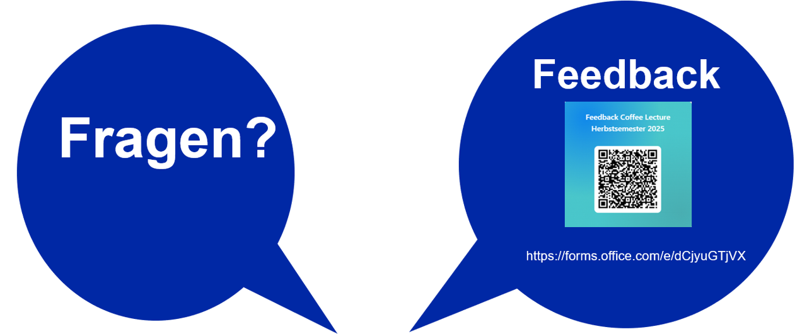

<header>

</header>

# Wahrheit oder Fälschung? Wie C2PA Licht ins Dunkel bringt

Nobutake Kamiya

---

<header class="header_2nd">

</header>

---

<header class="header_2nd">

</header>

## Hintergrund - Deepfake & Authentizität in KI-Zeitalter

... Ein Beispiel vom [X-Post von @eliothiggins.bsky.social (@EliotHiggins)](https://x.com/EliotHiggins/status/1637927681734987777)

---

<header class="header_2nd">

</header>

## Konzept 

Die Generierungs- bzw. Bearbeitungsnachweise der digitalen Medien erstellen und in deren Metadaten verzeichnen.
- [Coalition for Content Provenance and Authenticity (C2PA)](https://c2pa.org/) legt die technischen Standards fest
- [Content Authenticity Initiative (CAI)](https://contentauthenticity.org/) soll C2PA-Standards in diversen Produkte verbreiten

---

<header class="header_2nd">

</header>

## C2PA Specifications (Falls jemands sich dafür interessiert...)

https://c2pa.org/specifications/specifications/2.0/index.html

---

<header class="header_2nd">

</header>

## [Content Credentials](https://contentcredentials.org/)?

- ist eine Organization
- ..."Pin" für digitale Medien

---

<header class="header_2nd">

</header>

## [Content Credentials](https://contentcredentials.org/)!

[__Beispiel__](https://contentcredentials.org/verify/?source=https%3A%2F%2Fcontentcredentials.org%2F_app%2Fimmutable%2Fassets%2Fhome2.91ab8f2d.jpg)

---

<header class="header_2nd">

</header>

## Aktueller Stand

- Einige AI-Tools (ChatGPT, Adobe FireFly usw.) verleihen C2PA-Metadaten an die durch sie generierten Medien
- Die meisten Kameras und Aufnahmegeräte können nicht die C2PA-Metadaten generieren

### Fazit
C2PA-Metadaten sind noch nicht verbreitet. Weil viele industrielle Stakeholder wie Adobe, Google, Microsoft, OpenAI usw. und Hardware-Hersteller wie Nikon daran teilnehmen, ist es zu hoffen, dass der Standard sich durchsetzt und so die Authentizität der digitalen Medien mehr sichtbar wird... 

---

<header class="header_2nd">

</header>

## Tools 1

- [Verifier von ContentCredentials](https://contentcredentials.org/verify) - Eine Website, in der man C2PA-Metadaten visualisieren kann
- [Adobe Content Authenticity (Beta) - Website](https://contentauthenticity.adobe.com/apply) - Eine Browseranwendung, mit der man C2PA-Metadaten einem digitalen Contents hinzufügen kann
- [Adobe Content Authenticity (Beta) - GoogleChrome-Plugin](https://helpx.adobe.com/ch_de/creative-cloud/help/cai/adobe-content-authenticity-chrome-browser-extension.html) - Diese Browser-Erweiterung macht CR-Pin auf der Website sichtbar

---

<header class="header_2nd">

</header>

## Tools 2

- [Open Source Tools](https://opensource.contentauthenticity.org/docs/introduction/)

---

<header class="header_2nd">

</header>

## Demo

Demo-Website:
https://nbtkmy.github.io/webserve/testCR.html

---
<header class="header_2nd">

</header>

  
Kontakt

  
nobutake.kamiya@ub.uzh.ch

---

<header class="header_2nd">

</header>

## Vielen Dank!

