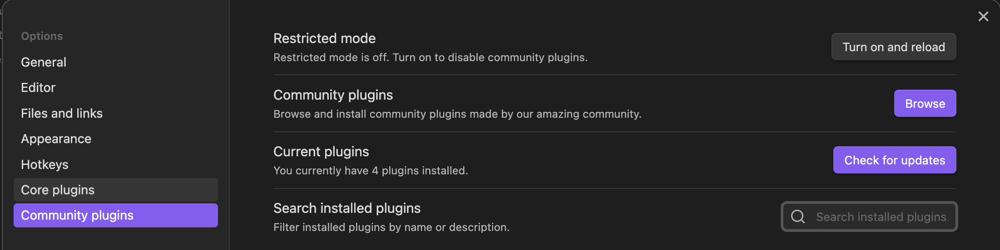

# Installing Obsidian & Ollama <br> a guidance

---

## Install & configure Obsidian

---

## Install the Obsidian
1. Visit the official site
1. Download the installer for your OS
1. Create your first "vault"
[Obsidian's official site](https://obsidian.md/)

---

## Configure your Obsidian
In order to install community plugins, you have to change the configuration as follows:


---

## Install plugins
After the configuration is changed, you can browse and install the community plugins.
In our class we use 2 plugins:
- LocalGPT
- Smart Second Brain
- AI Providers (required by LocalGPT)

---

## Install Ollama

---

1. Visit the [official site of Ollama](https://ollama.com/)
1. Download the installer for your OS
1. Install it!

---

## After the Installation completed...

Check if you can use Ollama in your command tool!
1. Open the terminal (PowerShell for MS, Terminal for Mac or Linux)
1. Type `ollama -v`
1. Then you can see the version of your Ollama!

---

## Pull one local model 

- Af first you should find a suitable model for your machine

```
You should have at least 8 GB of RAM available to run the 7B models, 16 GB to run the 13B models, and 32 GB to run the 33B models.
```
- And chose a model from the [official model list](https://ollama.com/search)
- The [Official instruction](https://github.com/ollama/ollama/blob/main/README.md) could be helpful to chose a model

---

### Model recommendation?
- If your laptop does not have so much RAM, take a small model like [deepseek-r1:1.5b](https://ollama.com/library/deepseek-r1:1.5b) or [llama3.2 (latest model has 3b)](https://ollama.com/library/llama3.2)
- When your device is more powerful, you can consider to pull a model with more parameters

---

### Do you already know which model you'll get?
Then run the following command in your terminal:
```
ollama pull [the model name]
```

For instance, if you want to use llama3.2:
```
ollama pull llama3.2
```
---

### Check which model do you have

...with this command in the terminal:

```
ollama list
```

---

### Run a model in terminal 
```
ollama run [the model name]
```
For example...:
```
ollama run llama3.2
```
After you run this command, you can start a chat with the model in the terminal

---

### Quit the chat with Ollama

... in Windows
```
Ctrl + d
```

... for Mac
```
control + d
```


